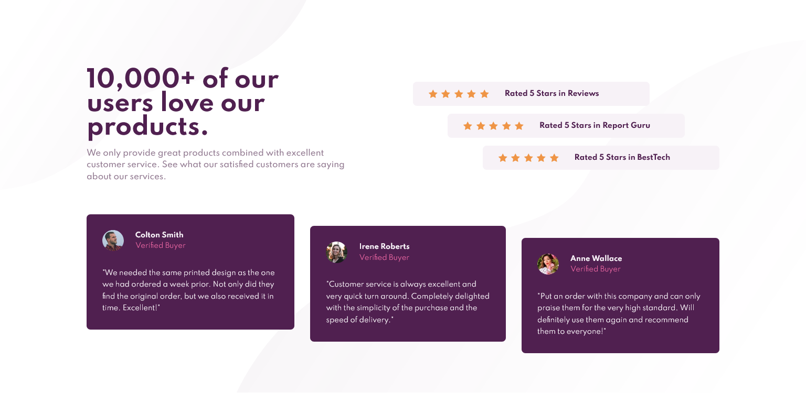

# Frontend Mentor - Social proof section solution

This is a solution to the [Social proof section challenge on Frontend Mentor](https://www.frontendmentor.io/challenges/social-proof-section-6e0qTv_bA). Frontend Mentor challenges help you improve your coding skills by building realistic projects.

## Table of contents

- [Overview](#overview)
  - [The challenge](#the-challenge)
  - [Screenshot](#screenshot)
  - [Links](#links)
- [My process](#my-process)
  - [Built with](#built-with)
  - [What I learned](#what-i-learned)
- [Author](#author)

## Overview

### The challenge

Users should be able to:

- View the optimal layout for the section depending on their device's screen size

### Screenshot

### Links

- Live Site URL: [https://polthm.github.io/faq-accordion-card/](https://polthm.github.io/faq-accordion-card/)

## My process

HTML then CSS (add a "reset.css" to have a clean start)

### Built with

- HTML
- CSS

### What I learned

To work better with flexbox and width

## Author

- Website - [https://pol-thomas.com/](https://pol-thomas.com/)
- Frontend Mentor - [@PolThm](https://www.frontendmentor.io/profile/PolThm)
